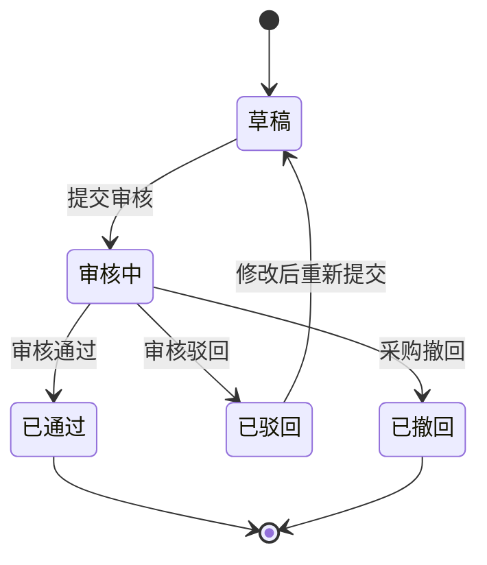

# 示例：全新复杂系统PRD

> 以下是一份按当前 PRD 编写规范整理的全新系统 PRD 示例，供生成时参考结构、菜单表、页面关系和细节粒度。

---

# 供应商准入协同系统-PRD

## 文档版本信息

| 版本号 | 更新人 | 更新时间 | 更新内容 | 备注 |
| ------ | ------ | -------- | -------- | ---- |
| V1.0   |        |          | 初始版本 |      |

## 一、需求说明

### 业务流程图

> 业务流程图：[diagrams/business-flow.drawio](diagrams/business-flow.drawio)（双击用 Draw.io 打开编辑）

### 用户旅程图

> 用户旅程图：[diagrams/user-journey.drawio](diagrams/user-journey.drawio)（双击用 Draw.io 打开编辑）

### 整体菜单结构

| 一级菜单                                  | 二级菜单                                                  | 页面类型 | 说明                                   |
| ----------------------------------------- | --------------------------------------------------------- | -------- | -------------------------------------- |
| [1. 供应商准入管理](#menu-供应商准入管理) | [1.1 供应商准入申请](#menu-供应商准入管理-供应商准入申请) | 列表页   | 采购专员创建、维护并提交供应商准入申请 |
|                                           | [1.2 准入审核管理](#menu-供应商准入管理-准入审核管理)     | 列表页   | 审核人处理准入申请并形成审核结论       |
| [2. 供应商档案管理](#menu-供应商档案管理) | [2.1 供应商档案台账](#menu-供应商档案管理-供应商档案台账) | 列表页   | 查看已准入供应商档案及准入状态         |

说明：一级菜单和二级菜单使用基于章节名称的稳定锚点链接，可点击快速定位到对应章节；只调整章节编号时，无需改动链接目标。

### 功能清单总览

| 一级菜单                                  | 二级菜单                                                  | 功能说明                             | 页面类型 | 使用角色               | 优先级 |
| ----------------------------------------- | --------------------------------------------------------- | ------------------------------------ | -------- | ---------------------- | ------ |
| [1. 供应商准入管理](#menu-供应商准入管理) | [1.1 供应商准入申请](#menu-供应商准入管理-供应商准入申请) | 创建、编辑、提交和跟踪供应商准入申请 | 列表页   | 采购专员               | P0     |
|                                           | [1.2 准入审核管理](#menu-供应商准入管理-准入审核管理)     | 审核供应商准入申请并维护审核结论     | 列表页   | 审核人                 | P0     |
| [2. 供应商档案管理](#menu-供应商档案管理) | [2.1 供应商档案台账](#menu-供应商档案管理-供应商档案台账) | 查询已准入供应商档案和准入状态       | 列表页   | 采购专员、供应商管理员 | P1     |

说明：“系统”角色指后台自动校验、状态更新或记录生成；优先级 P0 表示主流程必备能力，P1 表示支撑查询和管理能力，P2 表示体验优化或低频能力。

### 非菜单能力清单

| 能力名称           | 嵌入位置               | 触发时机         | 功能说明                         | 使用角色       | 优先级 |
| ------------------ | ---------------------- | ---------------- | -------------------------------- | -------------- | ------ |
| 申请提交完整性校验 | 供应商准入申请提交节点 | 点击"提交审核"时 | 校验申请资料完整性并阻断异常提交 | 采购专员、系统 | P0     |

### 1. 供应商准入管理

#### 1.1 供应商准入申请（新增）

模块概述：采购专员在本模块创建供应商准入申请，维护供应商基础资料、准入类型和附件材料，并提交给审核人处理。核心业务对象为准入申请单，状态口径包括草稿、审核中、已通过、已驳回、已撤回。

页面关系：

- 列表页 → 点击"新增"按钮 → 新增准入申请（详情页）
- 列表页 → 点击"编辑"按钮 → 编辑准入申请（详情页）
- 列表页 → 点击行记录 → 申请详情（抽屉）
- 列表页 → 点击"提交审核"按钮 → 提交确认（弹窗）
- 列表页 → 点击"撤回"按钮 → 撤回确认（弹窗）

**0. Mermaid辅助图**

下图用于说明准入申请单的核心状态流转。

**1. 字段**

| 字段名           | 类型 | 是否必填 | 枚举/默认值                  | 业务说明                       |
| ---------------- | ---- | -------- | ---------------------------- | ------------------------------ |
| 申请单号         | 文本 | 否       | 系统生成                     | 保存后生成，用于唯一识别申请单 |
| 供应商名称       | 文本 | 是       | 无                           | 申请准入的供应商名称           |
| 统一社会信用代码 | 文本 | 是       | 无                           | 用于识别供应商主体             |
| 准入类型         | 下拉 | 是       | 新供应商、品类扩展、临时准入 | 标识本次准入业务类型           |
| 采购组织         | 下拉 | 是       | 来源于采购组织主数据         | 表示供应商服务的采购组织范围   |
| 联系人           | 文本 | 是       | 无                           | 供应商联系人姓名               |
| 联系电话         | 文本 | 是       | 无                           | 供应商联系人电话               |
| 申请状态         | 下拉 | 否       | 草稿                         | 系统按流程自动更新             |
| 附件材料         | 附件 | 是       | 营业执照、资质证件           | 提交审核前必须上传             |

**2. 功能清单**

| 序号 | 功能名称 | 功能说明                         |
| ---- | -------- | -------------------------------- |
| 1    | 查询     | 按供应商、申请状态、准入类型查询 |
| 2    | 新增     | 创建准入申请并保存为草稿         |
| 3    | 编辑     | 修改草稿或已驳回申请             |
| 4    | 提交审核 | 将申请提交给审核人处理           |
| 5    | 撤回     | 撤回审核中的申请                 |
| 6    | 导出     | 导出列表查询结果                 |

**3. 列表展示及查询**

- 列表默认展示当前用户创建的准入申请，按更新时间倒序排列。
- 查询条件包括供应商名称、统一社会信用代码、准入类型、申请状态、采购组织、创建时间范围。
- 点击"查询"按钮后按条件刷新列表；点击"重置"按钮后清空查询条件并恢复默认列表。
- 列表字段包括申请单号、供应商名称、准入类型、采购组织、申请状态、创建人、创建时间、更新时间。

**4. 新增/编辑**

- 点击"新增"按钮 -> 进入新增准入申请详情页，申请状态默认为草稿。
- 用户填写供应商基础信息、准入类型、采购组织和附件材料后，点击"保存" -> 系统校验必填项 -> 保存草稿并返回申请单号。
- 草稿和已驳回状态允许编辑；审核中、已通过、已撤回状态不允许编辑。
- 编辑已驳回申请并重新提交后，申请状态变更为审核中。

**6. 导入/导出**

- 本模块不提供导入能力。
- 点击"导出"按钮 -> 系统按当前查询条件导出列表结果，导出内容包含列表展示字段和供应商基础字段。

**7. 交互流程**

- 用户点击"新增" -> 系统打开新增准入申请详情页。
- 用户点击"保存" -> 系统校验必填项和主体唯一性 -> 保存草稿并提示保存成功。
- 用户点击"提交审核" -> 系统执行申请提交完整性校验 -> 校验通过后弹出提交确认 -> 用户确认后状态变更为审核中。
- 用户点击"撤回" -> 系统弹出撤回确认 -> 用户确认后状态变更为已撤回。

**8. 业务规则**

- 同一统一社会信用代码在审核中或已通过状态下，不允许重复提交新供应商准入申请。
- 草稿状态仅创建人可编辑和删除；已驳回状态仅创建人可编辑后重新提交。
- 审核中状态只允许查看详情和撤回，不允许修改字段或附件。
- 已通过申请自动形成供应商档案台账记录，已驳回和已撤回申请不形成档案。

**9. 边界case**

- 空数据：无申请记录时，列表展示空状态并保留新增入口。
- 重复数据：统一社会信用代码重复且存在审核中或已通过申请时，提交时提示重复原因。
- 异常状态：审核人处理期间申请被撤回时，审核入口提示申请已撤回并停止处理。
- 并发操作：同一申请被多人同时编辑时，以先保存成功的数据为准，后保存用户需刷新后重试。

#### 1.2 准入审核管理（新增）

模块概述：审核人在本模块处理采购专员提交的准入申请，查看申请资料、填写审核意见并给出通过或驳回结论。该模块与供应商准入申请共享申请单状态，审核动作直接影响供应商档案是否生成。

页面关系：

- 列表页 → 点击行记录 → 审核详情（详情页）
- 列表页 → 点击"审核"按钮 → 审核处理（详情页）
- 审核处理页 → 点击"通过"按钮 → 通过确认（弹窗）
- 审核处理页 → 点击"驳回"按钮 → 驳回原因填写（弹框）

**1. 字段**

| 字段名   | 类型   | 是否必填 | 枚举/默认值        | 业务说明                     |
| -------- | ------ | -------- | ------------------ | ---------------------------- |
| 申请单号 | 文本   | 否       | 来源于准入申请     | 审核对象标识                 |
| 审核结论 | 下拉   | 是       | 通过、驳回         | 审核人处理结果               |
| 审核意见 | 长文本 | 否       | 无                 | 审核人填写的说明             |
| 驳回原因 | 长文本 | 条件必填 | 审核结论为驳回必填 | 记录驳回原因并返回给采购专员 |
| 审核时间 | 时间   | 否       | 系统生成           | 审核动作完成时间             |

**2. 功能清单**

| 序号 | 功能名称 | 功能说明                     |
| ---- | -------- | ---------------------------- |
| 1    | 查询     | 按申请单号、供应商、状态查询 |
| 2    | 查看详情 | 查看申请资料和附件           |
| 3    | 审核通过 | 审核通过并生成供应商档案     |
| 4    | 审核驳回 | 驳回申请并要求采购专员修改   |

**3. 列表展示及查询**

- 默认展示待当前审核人处理的审核中申请。
- 查询条件包括申请单号、供应商名称、准入类型、采购组织、提交时间范围。
- 列表字段包括申请单号、供应商名称、准入类型、采购组织、提交人、提交时间、当前状态。

**7. 交互流程**

- 审核人点击"审核" -> 系统打开审核处理页并展示申请资料和附件。
- 审核人点击"通过" -> 系统弹出通过确认 -> 确认后申请状态变更为已通过，并生成供应商档案台账记录。
- 审核人点击"驳回" -> 系统要求填写驳回原因 -> 确认后申请状态变更为已驳回，并将驳回原因返回申请详情。

**8. 业务规则**

- 只有审核中状态的申请允许审核处理。
- 审核驳回必须填写驳回原因；审核通过可选填审核意见。
- 审核通过时，如供应商档案台账已存在同一统一社会信用代码记录，系统仅更新准入状态和准入信息，不重复创建档案。
- 审核动作完成后不可撤销，如需修正需由采购专员重新发起准入申请。

**9. 边界case**

- 空数据：无待审核申请时，列表展示空状态。
- 重复处理：同一申请已被其他审核人处理时，系统提示状态已变化并刷新列表。
- 附件缺失：审核详情中发现附件不可访问时，审核人可驳回并说明原因。
- 并发操作：审核人打开详情后申请被采购专员撤回时，提交审核结论时提示申请已撤回。

### 2. 供应商档案管理（新增）

#### 2.1 供应商档案台账

模块概述：供应商档案台账用于承接已通过准入审核的供应商信息，支持采购专员和供应商管理员查询供应商准入状态、基础资料和准入记录。

页面关系：

- 列表页 → 点击行记录 → 供应商档案详情（抽屉）
- 列表页 → 点击"导出"按钮 → 导出确认（弹窗）

**1. 字段**

| 字段名           | 类型 | 是否必填 | 枚举/默认值      | 业务说明               |
| ---------------- | ---- | -------- | ---------------- | ---------------------- |
| 供应商编码       | 文本 | 否       | 系统生成         | 已准入供应商的档案编号 |
| 供应商名称       | 文本 | 否       | 来源于准入申请   | 供应商主体名称         |
| 统一社会信用代码 | 文本 | 否       | 来源于准入申请   | 供应商主体唯一识别信息 |
| 准入状态         | 下拉 | 否       | 已准入、准入失效 | 表示供应商当前准入结果 |
| 准入类型         | 文本 | 否       | 来源于准入申请   | 最近一次通过的准入类型 |
| 准入通过时间     | 时间 | 否       | 系统生成         | 审核通过时间           |

**2. 功能清单**

| 序号 | 功能名称 | 功能说明                     |
| ---- | -------- | ---------------------------- |
| 1    | 查询     | 查询已准入供应商档案         |
| 2    | 查看详情 | 查看供应商基础信息和准入记录 |
| 3    | 导出     | 导出当前查询结果             |

**3. 列表展示及查询**

- 查询条件包括供应商编码、供应商名称、统一社会信用代码、准入状态、准入通过时间范围。
- 列表字段包括供应商编码、供应商名称、统一社会信用代码、准入状态、准入类型、准入通过时间。
- 点击行记录后以抽屉展示档案详情和历史准入记录。

**6. 导入/导出**

- 本模块不提供导入能力，档案由准入审核通过后生成。
- 点击"导出"按钮 -> 系统按当前查询条件导出供应商档案列表。

**8. 业务规则**

- 供应商档案来源于已通过的准入申请，不支持人工新增。
- 同一统一社会信用代码只保留一条当前档案记录，历史准入信息在详情中按时间倒序展示。
- 准入状态为准入失效的供应商在列表中可查询，但不得作为新的采购合作对象使用。

**9. 边界case**

- 空数据：无已准入供应商时，列表展示空状态。
- 重复生成：同一申请重复触发审核通过结果时，不重复生成档案。
- 历史记录缺失：档案存在但历史准入记录为空时，详情展示基础档案并提示无历史记录。
- 并发查询：导出过程中查询条件被修改时，本次导出按点击导出时的查询条件执行。

### 3. 申请提交完整性校验（新增）

嵌入位置：供应商准入申请模块的提交审核节点。

触发时机：采购专员点击"提交审核"按钮时触发。

交互流程：

- 用户点击"提交审核" -> 系统校验必填字段、附件材料和重复申请 -> 校验通过后弹出提交确认。
- 校验不通过时 -> 系统阻断提交并展示失败原因，用户返回编辑页修改后可重新提交。

业务规则：

- 供应商名称、统一社会信用代码、准入类型、采购组织、联系人、联系电话和附件材料必须完整。
- 同一统一社会信用代码存在审核中或已通过的新供应商准入申请时，不允许再次提交新供应商准入。
- 校验失败不改变申请状态，仍保留草稿或已驳回状态。

边界case：

- 附件上传中点击提交时，系统提示等待附件上传完成。
- 必填字段被其他规则清空后点击提交时，系统按最新页面数据重新校验。
- 同一申请连续点击提交时，系统仅受理第一次有效提交，后续点击提示状态已更新。
