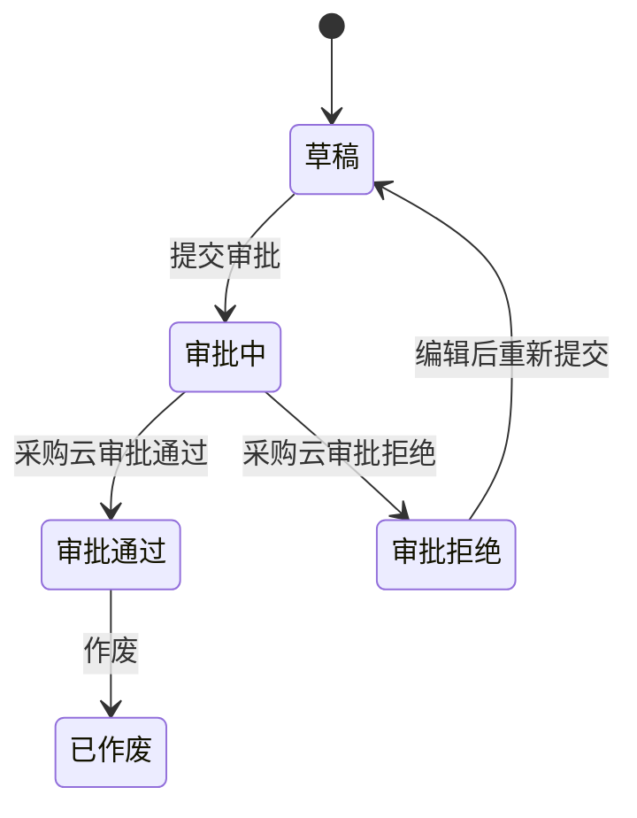
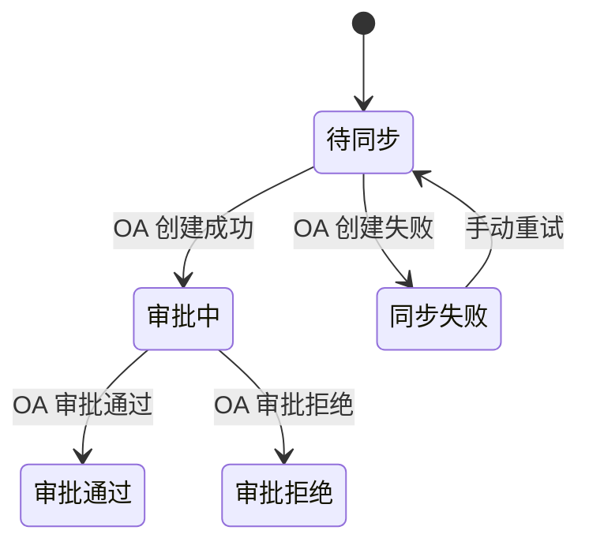
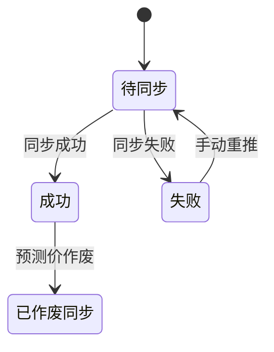

# 采购云成本管理模块优化建设-PRD

## 文档版本信息

| 版本号 | 更新人 | 更新时间 | 更新内容 | 备注 |
| ------ | ------ | -------- | -------- | ---- |
| V1.0 | Codex | 2026-06-01 | 初始版本 | 基于现有采购云成本模块优化需求整理 |

## 一、文档信息

| 项目 | 内容 |
| --- | --- |
| 项目名称 | 采购云成本管理模块优化建设 PRD |
| 系统类型 | 已有系统迭代升级 |
| 目标系统 | 采购云成本管理模块 |
| 适用品类 | 先以玻璃品类为主，后续扩展至其他品类 |
| 需求目标 | 将现有“成本核算工具”升级为“采购价格管理与成本分析平台” |
| 主要使用对象 | 成本管理员、品类采购员、品类负责人、采购领导、采购大领导、系统管理员 |

## 二、项目背景

采购云成本管理模块当前已具备基础成本核算能力，能够通过核算属性维护、物料属性基础价维护、供应商基础价维护、核算模板配置、核算单创建等功能，实现基于预设规则的价格计算。

当前系统核心能力为：基于核算模板、物料属性、基础价规则、供应商规则及公式逻辑，计算某个物料的最终价格。当前 UAT 主要验证玻璃品类，系统已实现“按模板规则算价”的基础闭环。

实际使用过程中，现有能力仍存在维护复杂、配置繁琐、价格数据不沉淀、预测价无版本台账、历史价格难查询、预实对比缺失、品类权限缺失、订单测算平台无法自动获取预测价、目标绩效无法量化等问题。本次不是从 0 到 1 新建系统，而是在现有采购云成本模块基础上做优化改造。

## 三、业务目标

| 目标 | 说明 |
| --- | --- |
| 规则标准化 | 将核算属性、属性值、价格因子、供应商价格规则形成可配置、可校验、可追溯的规则体系。 |
| 场景隔离 | 明确正式价和预测价在模板、规则、核算单、台账、报表、集成中的差异。 |
| 台账沉淀 | 建设正式价台账和预测价台账，沉淀物料、工厂、月份、价格、来源、版本和状态。 |
| 过程可追溯 | 展示价格来源、命中规则、公式过程、未命中原因、计算日志和版本依据。 |
| 业务协同 | 正式价联动 OA 调价审批；预测价同步订单测算平台。 |
| 分析复盘 | 支持价格走势、预实对比、价差分析、预测准确率、目标绩效和异常看板。 |
| 权限管控 | 按品类和角色控制成本数据可见、可操作和可导出范围。 |

## 四、现有系统功能说明

本章节用于识别现有系统已具备的能力，避免将已有功能重复定义为新增需求。本次 PRD 后续将按“已有功能 / 优化功能 / 新增功能 / 暂不纳入范围”区分。

### 4.1 核算属性维护

现有系统已有“核算属性维护列表”，用于维护成本核算中可被引用的字段/属性，作为后续基础价、供应商价、核算模板、核算单字段配置的字段来源。

| 属性类别 | 已有字段示例 | 来源/用途 |
| --- | --- | --- |
| 玻璃品类物料属性 | 长、宽、玻璃位置分类、厚度（mm）、玻璃工艺、面积、镀膜类型、外观、开孔情况、透光率%、开孔形状、开孔尺寸 | 主要来自 PLM，用于描述物料本身。 |
| 价格计算过程属性/价格因子 | 玻璃基础价、镀膜费用、涂釉费用、打孔单价、打孔费用、运费、每平米单价、每块玻璃价格 | 用于价格取值、公式计算和结果展示。 |
| OA 调价单字段 | 价格截止有效期、价格单位、销售税代码、月数、需求量、物料计量单位、供方名称、采购组织、物料编码、物料描述、供应商编码、采购主体、付款方式 | 正式价核算单同步 OA 调价单时使用。 |

现有问题：核算属性需要人工维护；属性名称必须与 PLM / SAP / OA 字段名称一致；字段来源和用途不清晰；属性被哪些模板、规则、公式引用不直观；停用或修改属性缺少影响范围提示；未形成统一属性字典。

### 4.2 物料属性基础价维护

现有系统已有“物料属性基础价维护列表”，用于维护某个品类下不同物料属性组合对应的价格。以玻璃为例，已可维护玻璃基础价、镀膜费用、涂釉费用、打孔单价、运费。

示例：品类 = 玻璃，厚度 = 3.2mm，玻璃工艺 = 压延，玻璃位置分类 = 正玻，则玻璃基础价 = 16 元。

现有问题：属性值必须与 PLM 返回值完全一致；基础价规则不区分正式价和预测价；预测价模板和正式价模板可能使用同一套基础价；缺少价格类型、有效期、版本、价格来源、命中说明、未命中原因；不便按价格因子批量维护和查看。

### 4.3 供应商基础价维护

现有系统已有“供应商基础价维护列表”，当前逻辑为按品类 + 供应商维护一个基础价，核算时在总价基础上做加减。该功能暂不符合实际业务需求，当前没有使用。

实际业务中，供应商差异可能体现在玻璃基础价、镀膜费用、打孔单价、涂釉费用、运费等多个价格因子上，而不是只对最终总价加减。

重要边界：供应商价格规则只用于正式价场景；预测价不关联供应商；预测价是预测物料未来月份的基础价格，不是预测某个供应商的价格。

### 4.4 核算模板管理

现有系统已有“核算模板管理列表”，用于配置某个品类的核算模板，定义核算单页面字段、字段来源、公式逻辑、显示隐藏、必填、可编辑、导入导出等。

| 字段来源 | 已有能力说明 | 玻璃模板示例 |
| --- | --- | --- |
| 手工 | 用户手工录入 | 部分调价单补充字段 |
| 系统 | 从 SAP / PLM / 系统自动获取 | PLM：长、宽、厚度、玻璃工艺、面积等；SAP：物料编码、描述、工厂、基本单位、物料组、采购组等 |
| 基础价表 | 从物料属性基础价中取值 | 玻璃基础价、镀膜费用、涂釉费用、打孔单价、运费 |
| 供方价表 | 从供应商基础价中取值 | 当前基础能力存在，但业务暂未使用 |
| 公式 | 通过公式计算 | 打孔费用、每平米单价、每块玻璃价格 |

现有问题：模板配置复杂，字段多，配置容易出错；模板可标识正式价/预测价，但基础价表未区分价格类型；缺少发布前校验、模板预览、公式校验、版本差异对比、取价规则完整性校验。

### 4.5 核算单管理

现有系统已有“核算单明细列表”和“核算单新增/编辑页”。用户选择模板和物料后，系统根据 SAP 物料主数据、PLM 物料属性、基础价表、供应商基础价、模板公式计算最终价格。

现有主流程：新建核算单 -> 选择公司、采购组织、业务类型、业务场景、视图品类、视图名称 -> 系统匹配已发布模板 -> 进入核算单页面 -> 填写基本信息 -> 获取物料或导入料工费 -> 系统获取 SAP 物料信息和 PLM 物料属性 -> 根据基础价表和模板公式计算价格 -> 提交核算单。

现有“获取物料”能力：物料编码、物料描述等来自 SAP；长、宽、厚度、玻璃工艺、面积等物料属性来自 PLM。

正式价核算单现状：提交后会把 OA 调价单需要的数据同步到 OA，目前提交后自动审批通过。后续需调整为真实 OA 审批联动：提交后状态为审批中；同步 OA 调价单；OA 单号回写采购云；OA 审批通过或拒绝后状态回传采购云；审批拒绝允许编辑后再次提交。

重要边界：OA 审批通过后同步 SAP 价格库是 OA 现有能力，不属于本次采购云改造范围；本 PRD 不设计采购云直接写 SAP 价格库。

## 五、现有问题分析

| 问题域 | 现有问题 | 影响 |
| --- | --- | --- |
| 属性管理 | 字段依赖人工维护，外部字段名称不一致时无法识别。 | 取数失败、规则无法命中、配置维护成本高。 |
| 属性值管理 | PLM 属性值与基础价条件值不一致时无法取价。 | 价格计算失败，需人工排查。 |
| 价格规则 | 基础价表不区分正式价/预测价，缺少版本和有效期。 | 预测价无法独立管理，正式价和预测价易混用。 |
| 供应商价格 | 只能总价加减，无法体现多个价格因子差异。 | 不符合正式价供应商差异业务。 |
| 模板配置 | 模板校验、预览、版本对比不足。 | 配置错误难提前发现。 |
| 核算单体验 | 异常提示不清、计算过程不透明、手工字段多。 | 业务复核成本高。 |
| 台账沉淀 | 缺少正式价/预测价统一台账。 | 历史价格难查询，预测版本无法复盘。 |
| 分析能力 | 缺少走势图、预实对比、价差分析、目标绩效。 | 管理层无法量化评估价格预测和采购绩效。 |
| 权限管理 | 缺少按品类的数据权限。 | 成本敏感数据存在越权风险。 |
| 集成协同 | 预测价未同步订单测算平台；OA 审批状态未形成闭环。 | 线下汇总多，流程状态不透明。 |

## 六、本次需求范围

### 6.1 范围总览

| 序号 | 优化方向 | 核心目标 | 类型 |
| --- | --- | --- | --- |
| 1 | 核算属性维护优化 | 从手工字段池升级为统一属性字典 | 优化功能 |
| 2 | 属性值标准化 | 解决 PLM 属性值与基础价条件不一致问题 | 新增功能 |
| 3 | 物料属性基础价优化 | 从基础价表升级为价格因子规则库 | 优化功能 |
| 4 | 供应商基础价改造 | 支持正式价场景下供应商维度多个价格因子差异 | 优化功能 |
| 5 | 正式价 / 预测价区分 | 预测模板使用预测规则，正式模板使用正式价规则 | 优化功能 |
| 6 | 核算模板易用性优化 | 降低模板配置复杂度和出错率 | 优化功能 |
| 7 | 核算单体验优化 | 提升物料选择、批量核算、异常处理体验 | 优化功能 |
| 8 | 计算过程可追溯 | 让最终价格可解释、可复核 | 新增功能 |
| 9 | OA 调价单集成 | 实现核算单到 OA 调价审批状态闭环 | 优化功能 |
| 10 | 调价单字段自动化 | 减少人工填写，提高准确性 | 优化功能 |
| 11 | 物料价格台账 | 沉淀物料、时间、价格、来源、版本 | 新增功能 |
| 12 | 价格走势图 | 支持物料价格随时间变化分析 | 新增功能 |
| 13 | 预实对比 | 分析预测价与正式价偏差 | 新增功能 |
| 14 | 价差分析 | 评价品类预测准确性和方向性判断 | 新增功能 |
| 15 | 订单测算平台对接 | 向订单测算平台输出采购预测价 | 新增功能 |
| 16 | 目标绩效管理 | 用预测价形成目标价并评价采购绩效 | 新增功能 |
| 17 | 权限管理 | 按品类、角色控制成本数据 | 新增功能 |
| 18 | 价格看板 | 面向业务和领导提供分析视图 | 新增功能 |
| 19 | 数据集成优化 | 打通 PLM、SAP、OA、订单测算平台 | 优化功能 |

### 6.2 不重复建设说明

| 已有功能 | 本次处理口径 |
| --- | --- |
| 核算属性维护列表 | 沿用入口，增强为统一属性字典。 |
| 物料属性基础价维护列表 | 沿用基础能力，升级为价格因子规则库。 |
| 供应商基础价维护列表 | 沿用入口或重构为供应商价格规则，仅用于正式价。 |
| 核算模板管理列表 | 沿用基础模板配置能力，增加校验、预览、版本对比和正式价/预测价隔离。 |
| 核算单明细列表与新增/编辑页 | 沿用核算单基础流程，拆分正式价核算单和预测价核算单体验。 |
| SAP / PLM 取数 | 沿用并增强数据完整性提示、属性值同步和异常日志。 |
| OA 调价单同步 | 沿用同步方向，优化为真实审批状态闭环。 |

## 七、术语定义

| 术语 | 定义 |
| --- | --- |
| 正式价 | 用于正式调价审批的价格，由采购云正式价核算单计算生成，可关联供应商，需要同步 OA 调价单，并沉淀正式价台账。 |
| 预测价 | 对未来月份物料基础价格的预测，不关联供应商，不触发 OA，不同步 SAP，需要沉淀预测价台账。 |
| 价格因子 | 价格计算中的组成项，如玻璃基础价、镀膜费用、打孔单价、运费、每平米单价等。 |
| 价格规则 | 某个价格因子在特定属性条件、价格类型、有效期和版本下的取值规则。 |
| 属性标准值 | 系统认可的属性值口径，用于将 PLM 原始值、别名和基础价条件值统一。 |
| 预测发起月份 | 发起预测的月份，如 2026-02。 |
| 被预测月份 | 预测价格适用的未来月份，如 2026-05。 |
| 预测版本 | 同一物料、同一被预测月份在不同预测发起月份形成的版本。 |
| 预实对比 | 以同一物料 + 同一工厂 + 同一价格月份为基础，对比预测价和正式价。 |

### 7.1 正式价定义

正式价是用于正式调价审批的价格。正式价由采购云正式价核算单计算生成，可关联供应商。正式价核算单在采购云审批通过后同步正式价台账并同步 OA 调价单；OA 承担审批功能，审批状态回传采购云；OA 审批通过后由 OA 按现有机制同步 SAP 价格库；采购云不负责 OA 到 SAP 的同步逻辑。

正式价链路：采购云正式价核算单 -> 采购云审批通过 -> 同步正式价台账 -> 同步 OA 调价单 -> OA 审批 -> OA 状态回传采购云 -> OA 按现有机制同步 SAP 价格库。

### 7.2 预测价定义

预测价是对未来月份物料基础价格的预测。预测价不关联供应商，不触发 OA 审批，不同步 SAP 价格库。预测价按月滚动预测未来月份价格，同一物料、同一被预测月份会存在多个预测版本。预测价用于订单测算平台、预实对比、价格趋势分析和目标绩效管理。

预测价链路：采购云预测价核算单 -> 采购云审批通过 -> 同步预测价台账 -> 同步订单测算平台 -> 用于预实对比、价格趋势、目标绩效分析。

示例：2026-02 可预测 2026-03 至 2026-12；2026-03 可预测 2026-04 至 2026-12。同一物料 M001 的 2026-05 预测价可存在 2026-02 预测版、2026-03 预测版、2026-04 预测版。

## 八、用户角色

| 角色 | 职责 | 数据范围 |
| --- | --- | --- |
| 品类成本管理员 | 维护属性、属性值、价格因子、价格规则、模板，处理核算异常。 | 授权品类 |
| 品类采购员 | 创建正式价核算单、预测价核算单，查看台账和分析结果。 | 授权品类 |
| 品类负责人 | 查看价格走势、预实对比、价差分析、目标绩效。 | 授权品类 |
| 采购领导 | 查看管理范围内品类的看板和报表。 | 管理范围内授权品类 |
| 采购大领导 | 查看公司级采购价格分析看板。 | 是否全部可见待确认 |
| 系统管理员 | 配置用户、角色、品类权限和基础系统参数。 | 是否可查看敏感价格待确认 |
| OA 审批人 | 在 OA 中审批正式调价单。 | OA 审批范围 |
| 订单测算人员 | 在订单测算平台使用采购云预测价进行订单成本测算。 | 订单测算平台权限范围 |

## 九、总体业务流程

> 业务流程图：[diagrams/business-flow.drawio](diagrams/business-flow.drawio)（双击用 Draw.io 打开编辑）

| 阶段 | 流程 | 说明 |
| --- | --- | --- |
| 规则准备 | 属性字典、属性值、价格因子、供应商价格规则、模板配置 | 成本管理员完成基础配置和发布校验。 |
| 核算发起 | 创建正式价核算单或预测价核算单 | 采购员/成本管理员按场景创建核算单。 |
| 数据获取 | 获取 SAP 物料主数据和 PLM 物料属性 | 系统自动取数并提示缺失字段。 |
| 价格计算 | 匹配正式价/预测价规则，执行公式，展示计算过程 | 系统展示命中规则、未命中原因和公式过程。 |
| 采购云审批 | 核算单提交后进入审批中，审批通过后才进入后续同步 | 正式价和预测价台账均来自采购云核算单审批通过后的同步。 |
| 正式价协同 | 同步正式价台账，同步 OA 调价单，接收 OA 状态 | OA 审批通过后按现有机制同步 SAP。 |
| 预测价协同 | 同步预测价台账，同步订单测算平台 | 预测价不含供应商字段。 |
| 分析复盘 | 价格走势、预实对比、价差分析、目标绩效、看板 | 数据按品类权限过滤。 |

## 十、正式价业务流程

| 步骤 | 用户/系统 | 操作 | 结果 |
| --- | --- | --- | --- |
| 1 | 采购员/成本管理员 | 新建正式价核算单，选择正式价模板、品类、物料、供应商、采购组织。 | 进入正式价核算单编辑页。 |
| 2 | 系统 | 获取 SAP 主数据和 PLM 物料属性。 | 回填物料字段并提示缺失数据。 |
| 3 | 系统 | 按正式价规则、供应商价格规则和公式计算价格。 | 输出正式价、价格组成和计算过程。 |
| 4 | 用户 | 补充或确认 OA 调价单字段，提交采购云审批。 | 核算单状态变为审批中。 |
| 5 | 采购云审批节点 | 审批通过或拒绝。 | 通过后同步正式价台账和 OA 调价单；拒绝后允许按权限编辑重提。 |
| 6 | 系统 | 创建 OA 调价单并回写 OA 单号。 | 采购云展示 OA 单号和 OA 审批状态。 |
| 7 | OA | 完成调价审批并回传状态。 | 采购云更新 OA 审批中、审批通过、审批拒绝。 |
| 8 | OA | 审批通过后按现有机制同步 SAP 价格库。 | SAP 价格库更新，此步骤不属于采购云改造范围。 |

## 十一、预测价业务流程

| 步骤 | 用户/系统 | 操作 | 结果 |
| --- | --- | --- | --- |
| 1 | 采购员/成本管理员 | 新建预测价核算单，选择预测价模板、预测发起月份、被预测月份、物料。 | 进入预测价核算单编辑页。 |
| 2 | 系统 | 获取 SAP 主数据和 PLM 物料属性。 | 回填物料字段并提示缺失数据。 |
| 3 | 系统 | 按预测价规则和公式计算物料基础预测价格。 | 输出预测价、预测版本和计算过程。 |
| 4 | 用户 | 提交采购云审批。 | 核算单状态变为审批中。 |
| 5 | 采购云审批节点 | 审批通过或拒绝。 | 通过后同步预测价台账；拒绝后允许按权限编辑重提。 |
| 6 | 系统 | 将预测价台账中的有效记录同步订单测算平台。 | 记录同步状态、失败原因和日志。 |
| 7 | 业务用户 | 使用预测价进行预实对比、价格走势、目标绩效分析。 | 形成分析结果和管理看板。 |

## 十二、系统边界

| 系统 | 负责范围 |
| --- | --- |
| 采购云 | 成本核算、正式价核算单、预测价核算单、核算属性、属性值标准化、价格因子规则、供应商正式价规则、核算模板、价格台账、价格走势图、预实对比、价差分析、目标绩效、品类权限、同步 OA 调价单、接收 OA 状态、同步预测价到订单测算平台、接口日志和异常管理。 |
| OA | 调价单审批、审批流转、审批通过后按现有机制同步 SAP 价格库。 |
| SAP | 提供物料主数据，承接 OA 同步的正式价格库数据。 |
| PLM | 提供物料属性和品类属性值。 |
| 订单测算平台 | 接收采购云预测价，用于订单成本测算。 |

## 十三、功能架构

| 功能域 | 功能模块 | 变更类型 |
| --- | --- | --- |
| 基础配置 | 核算属性维护、属性值标准化、价格因子、价格规则库、供应商价格规则 | 优化/新增 |
| 模板配置 | 核算模板、模板预览、发布校验、版本差异对比 | 优化/新增 |
| 核算执行 | 正式价核算单、预测价核算单、计算过程追溯、未命中规则清单 | 优化/新增 |
| 外部协同 | OA 同步记录、订单测算平台同步记录、接口日志 | 优化/新增 |
| 价格台账 | 正式价台账、预测价台账、预测价版本对比 | 新增 |
| 分析看板 | 价格走势图、预实对比、价差分析、目标绩效、报表看板 | 新增 |
| 权限管控 | 品类权限配置、角色操作权限、导出权限 | 新增 |

## 十四、页面清单

| 序号 | 页面/功能对象 | 所属功能域 | 类型 | 优先级 |
| --- | --- | --- | --- | --- |
| 1 | 核算属性维护列表 | 基础配置 | 优化 | P0 |
| 2 | 核算属性新增/编辑 | 基础配置 | 优化 | P0 |
| 3 | 属性值字典列表 | 基础配置 | 新增 | P0 |
| 4 | 属性值标准化维护 | 基础配置 | 新增 | P0 |
| 5 | 未识别属性值清单 | 基础配置 | 新增 | P1 |
| 6 | 价格因子列表 | 基础配置 | 新增 | P0 |
| 7 | 价格因子新增/编辑 | 基础配置 | 新增 | P0 |
| 8 | 价格规则库列表 | 基础配置 | 优化 | P0 |
| 9 | 价格规则新增/编辑 | 基础配置 | 优化 | P0 |
| 10 | 价格规则批量导入 | 基础配置 | 优化 | P1 |
| 11 | 供应商价格规则列表 | 基础配置 | 优化 | P0 |
| 12 | 供应商价格规则新增/编辑 | 基础配置 | 优化 | P0 |
| 13 | 核算模板管理列表 | 模板配置 | 优化 | P0 |
| 14 | 核算模板新增/编辑 | 模板配置 | 优化 | P0 |
| 15 | 模板预览 | 模板配置 | 新增 | P1 |
| 16 | 模板发布校验 | 模板配置 | 新增 | P0 |
| 17 | 模板版本差异对比 | 模板配置 | 新增 | P1 |
| 18 | 正式价核算单列表 | 核算执行 | 优化 | P0 |
| 19 | 正式价核算单新增/编辑 | 核算执行 | 优化 | P0 |
| 20 | 预测价核算单列表 | 核算执行 | 新增 | P0 |
| 21 | 预测价核算单新增/编辑 | 核算执行 | 新增 | P0 |
| 22 | 计算过程追溯弹窗 | 核算执行 | 新增 | P0 |
| 23 | 未命中规则清单 | 核算执行 | 新增 | P0 |
| 24 | OA 同步记录 | 外部协同 | 新增 | P0 |
| 25 | 正式价台账 | 价格台账 | 新增 | P0 |
| 26 | 预测价台账 | 价格台账 | 新增 | P0 |
| 27 | 预测价版本对比 | 价格台账 | 新增 | P1 |
| 28 | 价格走势图 | 分析看板 | 新增 | P1 |
| 29 | 预实对比分析 | 分析看板 | 新增 | P0 |
| 30 | 价差分析 | 分析看板 | 新增 | P1 |
| 31 | 订单测算平台同步记录 | 外部协同 | 新增 | P0 |
| 32 | 目标绩效管理看板 | 分析看板 | 新增 | P1 |
| 33 | 品类权限配置 | 权限管控 | 新增 | P0 |
| 34 | 报表看板 | 分析看板 | 新增 | P1 |
| 35 | 接口日志与异常管理 | 外部协同 | 新增 | P0 |

## 十五、各页面功能说明

### 15.1 基础配置页面

| 页面 | 字段 | 按钮/操作 | 交互与校验 | 状态 | 权限 |
| --- | --- | --- | --- | --- | --- |
| 核算属性维护列表 | 属性编码、属性名称、所属品类、字段来源、字段用途、数据类型、单位、是否参与取价、是否参与公式、是否同步 OA、是否进入台账、状态、更新时间 | 查询、重置、新增、编辑、停用、启用、导出、同步 PLM 属性、同步 SAP 字段、查看引用 | 按品类权限过滤；停用前校验引用范围；字段来源为外部系统时需维护外部字段映射 | 启用、停用 | 成本管理员可维护；采购员/负责人可查看授权品类 |
| 核算属性新增/编辑 | 属性编码、属性名称、所属品类、字段来源、外部系统字段编码、外部系统字段名称、字段用途、数据类型、单位、参与标识 | 保存、取消、查看引用 | 属性编码唯一；外部系统字段名可与显示名不同；参与 OA/台账需校验字段用途 | 启用、停用 | 成本管理员 |
| 属性值字典列表 | 品类、属性名称、标准值、外部原始值、别名、映射状态、来源系统、影响规则数量、最后同步时间 | 查询、同步 PLM 属性值、新增标准值、编辑、导入、导出、查看影响规则 | 未映射原始值进入未识别清单；标准值停用前提示影响规则 | 已映射、未映射、停用 | 成本管理员维护，业务角色查看 |
| 属性值标准化维护 | 品类、属性名称、标准值、别名、外部原始值、启用状态 | 保存、合并、停用、恢复 | 同一属性下标准值不可重复；别名不可同时映射多个标准值 | 启用、停用 | 成本管理员 |
| 未识别属性值清单 | 品类、属性名称、PLM 原始值、出现物料数、发现时间、处理状态 | 映射标准值、新建标准值、忽略、导出 | 处理后从未识别清单移出；忽略需填写原因 | 待处理、已处理、已忽略 | 成本管理员 |
| 价格因子列表 | 价格因子编码、名称、品类、分类、计算方式、单位、状态 | 查询、新增、编辑、停用、查看规则 | 停用前校验模板和规则引用 | 启用、停用 | 成本管理员 |
| 价格因子新增/编辑 | 价格因子编码、名称、品类、分类、计算方式、单位、备注 | 保存、取消 | 计算方式为公式计算时，不允许维护规则取值；最终价格项需可进入台账 | 启用、停用 | 成本管理员 |
| 价格规则库列表 | 规则编码、品类、价格类型、价格因子、属性条件组合、价格值、单位、生效日期、失效日期、版本号、优先级、状态 | 查询、新增、编辑、复制、停用、导入、导出、命中模拟、查看日志 | 正式价/预测价隔离；条件值从标准值选择；日期重叠需按优先级提示 | 草稿、启用、停用、失效 | 成本管理员 |
| 价格规则新增/编辑 | 品类、价格类型、价格因子、属性条件、价格值、单位、有效期、版本号、优先级 | 保存、发布、取消 | 必填属性条件完整；价格值为数字；预测价规则不得包含供应商 | 草稿、启用、停用 | 成本管理员 |
| 价格规则批量导入 | 导入文件、品类、价格类型、导入结果 | 下载模板、上传、校验、确认导入、导出错误 | 校验属性、标准值、价格类型、有效期、重复规则；错误行不导入 | 待校验、校验失败、导入成功 | 成本管理员 |
| 供应商价格规则列表 | 品类、供应商编码、供应商名称、价格类型、价格因子、价格值、单位、有效期、是否通用规则、优先级、状态 | 查询、新增、编辑、导入、导出、查看命中日志、差异分析 | 价格类型固定正式价；预测价模板不得引用 | 草稿、启用、停用、失效 | 成本管理员 |
| 供应商价格规则新增/编辑 | 品类、供应商、价格因子、价格值、单位、有效期、是否通用规则、优先级 | 保存、发布、取消 | 供应商例外价优先于通用价；同供应商同因子同有效期重复需提示 | 草稿、启用、停用 | 成本管理员 |

### 15.2 模板与核算执行页面

| 页面 | 字段 | 按钮/操作 | 交互与校验 | 状态 | 权限 |
| --- | --- | --- | --- | --- | --- |
| 核算模板管理列表 | 模板编号、模板名称、价格类型、品类、适用公司、采购组织、版本、发布状态、更新时间 | 查询、新增、编辑、复制、预览、发布、版本对比、停用 | 列表按品类权限过滤；停用前提示影响未完成核算单 | 草稿、已发布、停用 | 成本管理员 |
| 核算模板新增/编辑 | 基本信息、区块配置、字段配置、公式配置、导入导出配置、OA 字段配置 | 保存、预览、发布校验、发布、取消 | 预测价模板不得配置供应商价格规则；正式价模板同步 OA 时需配置 OA 必填字段 | 草稿、已发布 | 成本管理员 |
| 模板预览 | 模板字段、区块、显示隐藏、必填、可编辑、公式结果示例 | 返回、发布校验 | 预览只展示效果，不保存业务数据 | 无 | 成本管理员、业务确认人 |
| 模板发布校验 | 校验项、校验结果、风险等级、处理建议 | 重新校验、查看明细、确认发布 | 阻断项包括公式字段不存在、循环引用、OA 必填缺失、预测模板引用供应商价 | 通过、警告、阻断 | 成本管理员 |
| 模板版本差异对比 | 版本号、字段差异、公式差异、规则依赖差异、导入导出差异 | 选择版本、导出差异 | 差异按新增、删除、修改标识 | 无 | 成本管理员、品类负责人 |
| 正式价核算单列表 | 核算单号、品类、供应商、物料数、采购云审批状态、OA 单号、OA 状态、创建人、更新时间 | 查询、新增、编辑、提交、撤回、查看、导出、同步记录 | 审批中不可编辑；驳回后允许编辑重提；按品类权限过滤 | 草稿、审批中、审批通过、审批拒绝、已作废 | 采购员、成本管理员 |
| 正式价核算单新增/编辑 | 基本信息、物料清单、供应商、SAP 字段、PLM 属性、价格因子、OA 字段、计算结果 | 保存草稿、获取物料、导入、试算、提交审批、查看计算过程、生成 PDF | 正式价必须选择供应商；提交前校验 OA 必填；采购云审批通过后同步正式价台账和 OA | 草稿、审批中、审批通过、审批拒绝 | 采购员、成本管理员 |
| 预测价核算单列表 | 核算单号、品类、预测发起月份、被预测月份、物料数、审批状态、台账同步状态、订单测算同步状态 | 查询、新增、编辑、提交、查看、导出、同步记录 | 不展示供应商查询条件；按品类权限过滤 | 草稿、审批中、审批通过、审批拒绝、已作废 | 采购员、成本管理员 |
| 预测价核算单新增/编辑 | 基本信息、预测发起月份、被预测月份、物料清单、SAP 字段、PLM 属性、价格因子、预测结果 | 保存草稿、获取物料、批量导入、试算、提交审批、查看计算过程 | 不允许选择供应商；审批通过后同步预测价台账；预测价台账同步订单测算平台 | 草稿、审批中、审批通过、审批拒绝 | 采购员、成本管理员 |
| 计算过程追溯弹窗 | 价格因子、字段来源、命中规则、公式、代入值、计算结果、规则版本、模板版本 | 查看规则、查看公式、导出、关闭 | 从核算单、台账、走势图均可穿透查看 | 无 | 有核算单/台账查看权限的用户 |
| 未命中规则清单 | 核算单号、物料、价格因子、未命中字段、字段值、规则类型、处理建议 | 查询、导出、跳转规则维护、忽略 | 未命中阻断核算时禁止提交；非阻断项提示确认 | 待处理、已处理、已忽略 | 成本管理员、采购员 |
| OA 同步记录 | 核算单号、OA 单号、同步状态、失败原因、请求时间、响应时间、重试次数 | 查询、重试、查看详情、导出 | 仅正式价有 OA 同步记录；失败可重试 | 待同步、成功、失败 | 成本管理员、采购员 |

### 15.3 台账、分析、权限与日志页面

| 页面 | 字段 | 按钮/操作 | 交互与校验 | 状态 | 权限 |
| --- | --- | --- | --- | --- | --- |
| 正式价台账 | 台账编号、品类、物料编码、物料描述、工厂、供应商、正式价格、价格单位、税率、有效期、来源核算单、OA 单号、OA 状态 | 查询、导出、查看来源、查看计算过程、作废 | 仅承接采购云审批通过的正式价核算单；含供应商字段 | 有效、作废 | 授权品类用户 |
| 预测价台账 | 台账编号、品类、物料编码、物料描述、工厂、预测发起月份、被预测月份、预测版本、预测基础价格、价格单位、来源核算单、订单测算同步状态 | 查询、导出、查看来源、查看计算过程、作废、重推订单测算 | 不包含供应商字段；仅承接采购云审批通过的预测价核算单 | 有效、作废 | 授权品类用户 |
| 预测价版本对比 | 品类、物料、工厂、被预测月份、预测发起月份、版本、预测价 | 查询、版本对比、导出 | 同一物料同一被预测月份可展示多个预测版本 | 有效、作废 | 品类负责人、成本管理员 |
| 价格走势图 | 品类、物料、工厂、价格类型、预测发起月份、被预测月份、时间范围 | 查询、切换图例、查看明细、穿透来源、导出 | 折线图与明细表联动；异常偏差标识 | 无 | 授权品类用户 |
| 预实对比分析 | 品类、物料、工厂、价格月份、预测版本、预测价、正式价、偏差金额、偏差率 | 查询、导出、查看来源 | 多供应商正式价对比口径待确认；未确认前提供口径筛选配置但不默认固化 | 无 | 品类负责人、采购领导 |
| 价差分析 | 品类平均偏差率、方向性准确率、偏差 TOP、异常阈值 | 查询、导出、阈值配置 | 超阈值标识异常；按品类权限过滤 | 正常、异常 | 品类负责人、采购领导 |
| 订单测算平台同步记录 | 来源预测价台账、物料、工厂、预测月份、预测价格、预测版本、同步状态、失败原因 | 查询、重推、查看日志、导出 | 同步字段不含供应商；作废后同步状态 | 待同步、成功、失败 | 成本管理员 |
| 目标绩效管理看板 | 品类、物料、工厂、月份、预测版本、目标价、正式价、差异、达成结果、节约/超支 | 查询、导出、穿透来源 | 差异率分母和达成规则待确认 | 达成、未达成 | 品类负责人、采购领导 |
| 品类权限配置 | 用户、授权品类、角色、操作权限、生效日期、失效日期、状态 | 新增、编辑、停用、导入、导出 | 用户可授权一个或多个品类；导出权限独立控制 | 启用、停用 | 系统管理员/授权管理员 |
| 报表看板 | 正式价数量、预测价数量、物料数、品类数、异常数、未命中规则数、同步失败数、方向性准确率、目标达成率 | 筛选、导出、穿透明细 | 看板数据按授权品类过滤 | 无 | 采购领导、品类负责人 |
| 接口日志与异常管理 | 接口名称、来源系统、目标系统、来源单据、请求时间、响应时间、调用状态、失败原因、重试次数、操作人 | 查询、重试、查看详情、导出、标记处理 | 失败日志需保留原因；重试需记录次数 | 成功、失败、处理中、已处理 | 成本管理员、系统管理员 |

## 十六、字段清单

### 16.1 核算属性字段

| 字段名 | 类型 | 是否必填 | 枚举/默认值 | 业务说明 |
| --- | --- | --- | --- | --- |
| 属性编码 | 文本 | 是 | 系统生成或手工维护 | 属性唯一标识。 |
| 属性名称 | 文本 | 是 | 无 | 业务展示名称。 |
| 所属品类 | 下拉 | 是 | 品类主数据 | 支持按品类隔离。 |
| 字段来源 | 下拉 | 是 | PLM、SAP、OA、手工扩展、公式、系统生成 | 标识字段来源。 |
| 外部系统字段编码 | 文本 | 条件必填 | 无 | 字段来源为外部系统时必填。 |
| 外部系统字段名称 | 文本 | 条件必填 | 无 | 用于映射 PLM/SAP/OA 字段。 |
| 字段用途 | 多选 | 是 | 物料属性、价格因子、计算结果、调价字段、展示字段 | 支持多用途。 |
| 数据类型 | 下拉 | 是 | 文本、数字、日期、金额、枚举 | 用于校验和公式计算。 |
| 单位 | 文本 | 否 | 无 | 如 mm、元、元/平米。 |
| 是否参与取价 | 布尔 | 是 | 否 | 是则可作为价格规则条件。 |
| 是否参与公式 | 布尔 | 是 | 否 | 是则可被公式引用。 |
| 是否同步 OA | 布尔 | 是 | 否 | 正式价同步 OA 使用。 |
| 是否进入台账 | 布尔 | 是 | 否 | 控制是否沉淀到价格台账。 |
| 状态 | 枚举 | 是 | 启用 | 启用、停用。 |

### 16.2 价格规则字段

| 字段名 | 类型 | 是否必填 | 枚举/默认值 | 业务说明 |
| --- | --- | --- | --- | --- |
| 规则编码 | 文本 | 否 | 系统生成 | 规则唯一标识。 |
| 品类 | 下拉 | 是 | 品类主数据 | 如玻璃。 |
| 价格类型 | 下拉 | 是 | 正式价、预测价 | 用于规则隔离。 |
| 价格因子 | 下拉 | 是 | 已启用价格因子 | 如玻璃基础价、镀膜费用。 |
| 属性条件组合 | 条件组 | 是 | 标准值 | 支持多属性组合。 |
| 价格值 | 数字 | 是 | 无 | 对应价格因子取值。 |
| 单位 | 文本 | 是 | 继承价格因子 | 允许按规则覆盖。 |
| 生效日期 | 日期 | 是 | 无 | 规则生效日期。 |
| 失效日期 | 日期 | 否 | 无 | 规则失效日期。 |
| 版本号 | 文本 | 是 | 系统生成 | 规则版本。 |
| 优先级 | 数字 | 是 | 100 | 数字越小优先级越高，具体排序口径可配置。 |
| 状态 | 枚举 | 是 | 草稿 | 草稿、启用、停用、失效。 |

### 16.3 正式价台账字段

| 字段名 | 类型 | 是否必填 | 业务说明 |
| --- | --- | --- | --- |
| 台账编号 | 文本 | 否 | 系统生成。 |
| 价格类型 | 枚举 | 是 | 固定正式价。 |
| 品类 | 下拉 | 是 | 物料品类。 |
| 物料编码 | 文本 | 是 | SAP 物料编码。 |
| 物料描述 | 文本 | 否 | SAP 物料描述。 |
| 工厂 | 文本 | 是 | 适用工厂。 |
| 供应商编码 | 文本 | 是 | 正式价适用供应商。 |
| 供应商名称 | 文本 | 是 | 正式价适用供应商名称。 |
| 正式价格 | 金额 | 是 | 核算结果价格。 |
| 价格单位 | 文本 | 是 | 如元/件。 |
| 税率 | 文本 | 否 | 来源于调价字段或规则。 |
| 价格截止有效期 | 日期 | 否 | OA 调价单字段。 |
| 来源核算单 | 文本 | 是 | 采购云正式价核算单编号。 |
| OA 单号 | 文本 | 否 | OA 创建成功后回写。 |
| OA 审批状态 | 枚举 | 否 | 审批中、审批通过、审批拒绝。 |
| 状态 | 枚举 | 是 | 有效、作废。 |

### 16.4 预测价台账字段

| 字段名 | 类型 | 是否必填 | 业务说明 |
| --- | --- | --- | --- |
| 台账编号 | 文本 | 否 | 系统生成。 |
| 价格类型 | 枚举 | 是 | 固定预测价。 |
| 品类 | 下拉 | 是 | 物料品类。 |
| 物料编码 | 文本 | 是 | SAP 物料编码。 |
| 物料描述 | 文本 | 否 | SAP 物料描述。 |
| 工厂 | 文本 | 是 | 预测价格适用工厂。 |
| 预测发起月份 | 年月 | 是 | 如 2026-02。 |
| 被预测月份 | 年月 | 是 | 如 2026-05。 |
| 预测版本 | 文本 | 是 | 如 2026 年 2 月预测版。 |
| 预测基础价格 | 金额 | 是 | 物料基础预测价格。 |
| 价格单位 | 文本 | 是 | 如元/件。 |
| 来源核算单 | 文本 | 是 | 采购云预测价核算单编号。 |
| 同步订单测算状态 | 枚举 | 是 | 待同步、成功、失败。 |
| 状态 | 枚举 | 是 | 有效、作废。 |

说明：预测价台账不包含供应商字段。

## 十七、业务规则

| 编号 | 规则 | 说明 |
| --- | --- | --- |
| R1 | 字段来源映射 | PLM/SAP/OA 字段可与采购云显示名不同，但必须维护映射关系。 |
| R2 | 属性值标准化 | 价格规则维护应优先选择标准值；PLM 原始值通过别名映射到标准值后参与取价。 |
| R3 | 正式价/预测价规则隔离 | 正式价模板只能使用正式价规则；预测价模板只能使用预测价规则。 |
| R4 | 供应商价格规则适用范围 | 供应商价格规则仅正式价适用；预测价不判断供应商，不读取供应商价格规则。 |
| R5 | 供应商取价优先级 | 正式价核算先取供应商专属价格规则，无专属规则时取品类通用规则。 |
| R6 | 模板发布校验 | 存在公式字段缺失、循环引用、OA 必填缺失、预测模板引用供应商价等阻断项时禁止发布。 |
| R7 | 核算单提交校验 | 数据缺失、必填未填、阻断类未命中价格时禁止提交。 |
| R8 | 台账同步触发 | 正式价台账和预测价台账均从采购云核算单审批通过后同步生成。 |
| R9 | 正式价 OA 集成 | 正式价核算单采购云审批通过后同步 OA 调价单，并接收 OA 状态回传。 |
| R10 | 预测价订单测算同步 | 预测价台账有效记录同步订单测算平台，同步字段不含供应商。 |
| R11 | 预实对比口径 | 基本口径为同一物料 + 同一工厂 + 同一价格月份，正式价多供应商场景口径待确认。 |
| R12 | 权限过滤 | 所有列表、台账、看板、导出均按用户授权品类过滤。 |

## 十八、状态流转

### 18.1 采购云核算单状态

### 18.2 OA 状态

### 18.3 订单测算同步状态

## 十九、权限设计

| 控制对象 | 控制规则 |
| --- | --- |
| 核算属性 | 仅可查看和维护授权品类相关属性。 |
| 属性值 | 仅可查看和维护授权品类属性值。 |
| 价格因子规则 | 仅可查看和维护授权品类价格规则。 |
| 供应商价格规则 | 仅正式价场景适用，按授权品类过滤。 |
| 核算模板 | 仅可查看和维护授权品类模板。 |
| 核算单 | 仅可查看和操作授权品类核算单。 |
| 价格台账 | 仅可查看授权品类价格记录。 |
| 报表看板 | 看板数据按授权品类过滤。 |
| 导出 | 导出权限单独控制，且只导出授权品类范围内数据。 |
| 操作权限 | 新增、编辑、删除、发布、提交、审批、作废、导出按角色控制。 |

| 角色 | 查看 | 新增/编辑 | 发布规则/模板 | 提交核算单 | 作废台账 | 导出 | 权限配置 |
| --- | --- | --- | --- | --- | --- | --- | --- |
| 品类成本管理员 | 授权品类 | 是 | 是 | 是 | 是 | 可配置 | 否 |
| 品类采购员 | 授权品类 | 核算单 | 否 | 是 | 否 | 可配置 | 否 |
| 品类负责人 | 授权品类 | 否 | 否 | 否 | 否 | 可配置 | 否 |
| 采购领导 | 管理范围 | 否 | 否 | 否 | 否 | 可配置 | 否 |
| 采购大领导 | 待确认 | 否 | 否 | 否 | 否 | 可配置 | 否 |
| 系统管理员 | 待确认 | 权限相关 | 否 | 否 | 否 | 待确认 | 是 |

## 二十、接口设计

本章节仅定义业务集成需求，不展开接口参数、数据库设计或技术实现。

| 接口/集成能力 | 来源系统 | 目标系统 | 触发时机 | 业务数据 | 异常处理 |
| --- | --- | --- | --- | --- | --- |
| SAP 物料查询 | SAP | 采购云 | 获取物料时 | 物料编码、描述、工厂、单位、物料类型、物料组、采购组等 | 获取失败提示重试；记录日志。 |
| PLM 属性查询 | PLM | 采购云 | 获取物料属性时 | 长、宽、厚度、玻璃工艺、面积等品类属性 | 缺失字段集中提示；记录异常。 |
| PLM 属性值同步 | PLM | 采购云 | 手动同步或定期同步 | 品类属性值和原始值 | 未识别值进入未识别清单。 |
| OA 调价单创建 | 采购云 | OA | 正式价核算单采购云审批通过后 | OA 调价单字段和正式价结果 | 创建失败展示原因并支持重试。 |
| OA 状态回传 | OA | 采购云 | OA 审批状态变化时 | OA 单号、审批状态、审批意见 | 回传失败记录日志，支持补偿处理。 |
| 订单测算平台同步 | 采购云 | 订单测算平台 | 预测价台账生成或重推时 | 物料编码、物料描述、工厂、预测月份、预测价格、价格单位、品类、预测发起月份、预测版本、来源核算单、状态 | 同步失败记录原因，支持手动重推。 |

说明：OA 同步 SAP 价格库属于 OA 现有能力，不属于本次采购云改造范围。

## 二十一、报表看板设计

| 看板 | 指标/内容 | 查询维度 | 权限 |
| --- | --- | --- | --- |
| 价格总览看板 | 正式价数量、预测价数量、物料数、品类数、异常数、未命中规则数、同步失败数 | 品类、工厂、月份 | 按授权品类 |
| 物料价格走势图 | 正式价线、预测价线、版本线、偏差标识、明细表 | 物料、工厂、价格类型、时间范围 | 按授权品类 |
| 品类价格趋势看板 | 品类价格均值、价格波动、异常物料 | 品类、月份 | 按授权品类 |
| 预测价版本看板 | 不同预测发起月份对同一被预测月份的预测变化 | 物料、被预测月份、预测发起月份 | 按授权品类 |
| 预实对比看板 | 预测价、正式价、偏差金额、偏差率 | 品类、物料、工厂、月份 | 按授权品类 |
| 价差分析看板 | 品类平均偏差率、物料偏差率、偏差 TOP | 品类、物料、月份 | 按授权品类 |
| 方向性判断看板 | 预测方向、实际方向、方向性准确率 | 品类、物料、月份 | 按授权品类 |
| 品类价格复盘看板 | 预测质量、价格波动、异常原因 | 品类、月份 | 按授权品类 |
| 目标绩效看板 | 目标价、正式价、达成率、节约/超支 | 品类、物料、工厂、月份、版本 | 按授权品类 |
| 数据异常看板 | 属性缺失、价格未命中、同步失败、接口异常 | 异常类型、系统、时间 | 按授权品类 |
| 供应商价格对比看板 | 供应商正式价、价格因子差异、供应商差异排名 | 品类、供应商、价格因子 | 仅正式价，按授权品类 |

## 二十二、异常处理

| 异常场景 | 触发时机 | 系统处理 |
| --- | --- | --- |
| SAP 物料获取失败 | 获取物料 | 提示失败原因，允许重试，记录接口日志。 |
| PLM 属性缺失 | 获取属性 | 在物料行标识缺失字段，阻断或警告按模板配置执行。 |
| 未识别属性值 | 取价前 | 进入未识别属性值清单，提示维护标准值或别名。 |
| 价格规则未命中 | 价格计算 | 进入未命中规则清单，展示未命中字段和处理建议。 |
| 公式计算失败 | 试算/提交 | 展示公式、代入值和失败原因，阻断提交。 |
| 模板发布校验失败 | 发布模板 | 阻断发布并展示失败项。 |
| OA 创建失败 | 正式价审批通过后同步 OA | 展示失败原因，支持重试，记录日志。 |
| OA 状态回传失败 | OA 状态变化 | 记录异常，支持补偿或人工处理。 |
| 订单测算同步失败 | 预测价台账同步 | 标记失败，记录原因，支持手动重推。 |
| 并发编辑 | 多人编辑同一单据/规则 | 后保存用户提示数据已变化，需刷新后重试。 |
| 权限越界 | 查询/导出/操作 | 阻断操作并提示无权限。 |
| 历史模板版本引用 | 查看历史核算单 | 历史核算单按当时模板版本、规则版本展示计算过程。 |

## 二十三、非功能需求

| 分类 | 要求 |
| --- | --- |
| 可用性 | 列表、台账、看板需支持空状态、加载态、失败重试。 |
| 可追溯 | 核算单、规则、模板、台账、同步日志均需保留操作人和时间。 |
| 性能 | 常规列表查询在合理数据量下应满足业务可接受响应；大批量导入、导出、同步需异步处理并展示进度。 |
| 安全 | 成本价格数据按品类和角色控制；导出需单独授权并记录日志。 |
| 兼容 | 历史核算单保留原计算结果，新增规则版本不反向改写历史结果。 |
| 易用性 | 复杂配置需提供校验、预览、错误定位和示例模板。 |
| 审计 | 关键操作如发布规则、发布模板、提交审批、作废台账、导出价格需记录审计日志。 |

## 二十四、不纳入范围

| 不纳入事项 | 边界说明 |
| --- | --- |
| 采购云直接写 SAP 价格库 | OA 审批通过后同步 SAP 价格库是 OA 现有能力，本次不设计采购云写 SAP。 |
| 预测价关联供应商 | 预测价是物料基础价格预测，不关联供应商，不包含供应商字段。 |
| OA 审批流配置改造 | OA 内部审批流配置由 OA 系统负责，本 PRD 仅要求采购云创建 OA 单据并接收状态。 |
| 订单测算平台内部测算逻辑 | 订单测算平台负责使用预测价进行测算，本 PRD 仅定义预测价同步和日志。 |
| 全品类一次性深度建模 | 本次先以玻璃品类验证，后续品类复用规则体系扩展。 |
| 技术接口参数和数据库设计 | 本 PRD 只描述业务集成能力，不展开技术实现。 |

## 二十五、待确认问题清单

| 序号 | 问题 | 影响范围 | 建议确认方向 |
| --- | --- | --- | --- |
| 1 | 正式价存在多个供应商价格时，预实对比采用主供应商价、平均价、最新正式价还是指定正式价？ | 预实对比、价差分析、目标绩效 | 由采购业务确认统一口径，可支持筛选口径但需默认规则。 |
| 2 | 偏差率分母采用正式价还是预测价？ | 预实对比、价差分析、目标绩效 | 建议统一配置，报表展示口径说明。 |
| 3 | 目标绩效达成/未达成判定规则是什么？ | 目标绩效管理 | 需确认按价格低于目标、偏差阈值或方向性判断。 |
| 4 | 采购云核算单审批流是否采购云内部审批，还是仅状态流转后同步 OA？ | 正式价/预测价核算单、台账同步 | 当前按“采购云审批通过后同步台账”编写，审批节点和角色需确认。 |
| 5 | 采购大领导是否可查看全部品类价格？ | 权限管理、报表看板 | 需按公司成本数据权限策略确认。 |
| 6 | 系统管理员是否可查看敏感价格数据？ | 权限管理 | 建议系统管理员可管权限，但是否可看价格需单独授权。 |
| 7 | 需求量/月数字段是否从订单测算平台、预测数据或手工填写获取？ | 调价单字段自动化 | 当前作为待确认字段，不固化来源。 |
| 8 | 订单测算平台默认取用哪个预测版本？ | 预测价台账、订单测算同步 | 建议支持最新有效版本和指定版本两种模式，默认口径需确认。 |
| 9 | 预测价作废后订单测算平台如何处理已使用数据？ | 订单测算平台同步 | 需确认是否同步作废状态、是否影响历史测算结果。 |
| 10 | 核算单 PDF 是否必须带出完整计算依据，还是可按权限控制显示？ | 核算单体验、计算追溯 | 建议按模板配置和权限控制。 |
